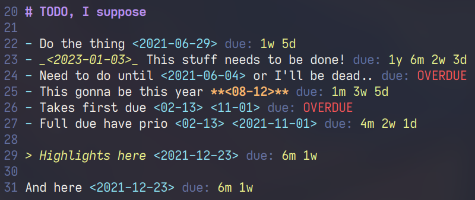

# dueVir

Simple plugin that provides you due for the date string.



## Requirements

- Neovim Nightly (0.5) (may work with 0.4.4 idk test it and message me lol)

## Installation

I don't think any vim-ish plugin manager can install this lua shit. So it is
[packer.nvim](https://github.com/wbthomason/packer.nvim) and similarities only...

```lua
use {
  'NFrid/dueVir',
  config = function()
    require('dueVir').setup{}
  end
}
```

Or you may implement your own 'setup' due to mine just being couple of aucmds
with plugin's functions (listed below).

## Variables

Plugin's settings are all in vim variables. There are all of them, with their
default values, in lua, of course:

```lua
vim.g.dueVir_prescript = 'due: '      -- prescript to due data
vim.g.dueVir_prescript_hi = 'Comment' -- highlight group of it
vim.g.dueVir_due_hi = 'String'        -- highlight group of the data itself
vim.g.dueVir_ft = '*.md'              -- filename to apply aucmds :)
vim.g.dueVir_overdue = 'OVERDUE'      -- text for overdued data
vim.g.dueVir_overdue_hi = 'Error'     -- highlight group of overdued
```

## TODO

idk if I ever will develop this thing more... In case of somebody needs it, here
are my 'plans' on it:

- Pattern as a setting
- Multiple patterns
- Settings in setup function
- idk time?????
